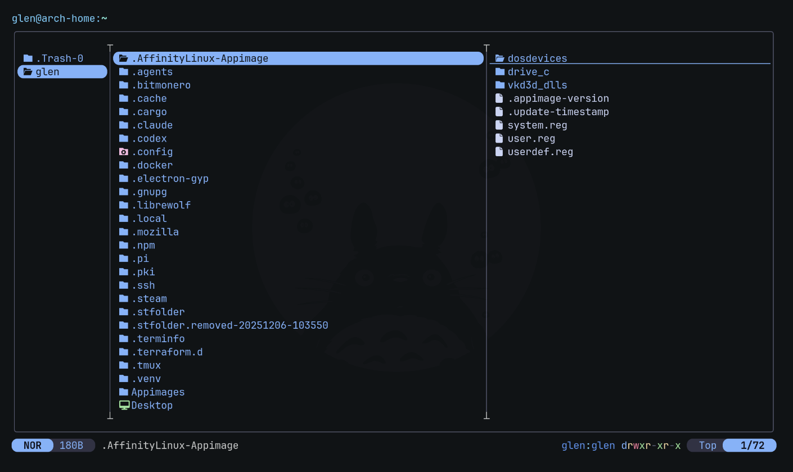
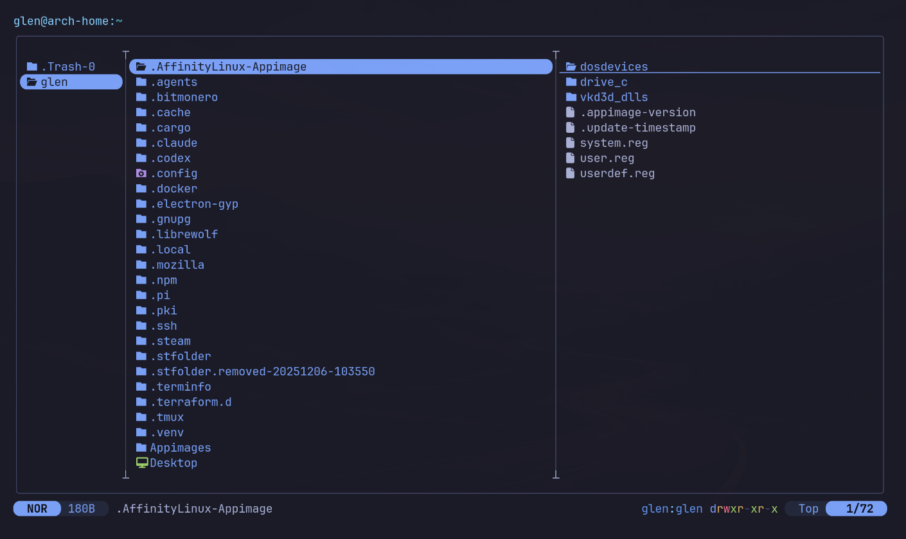
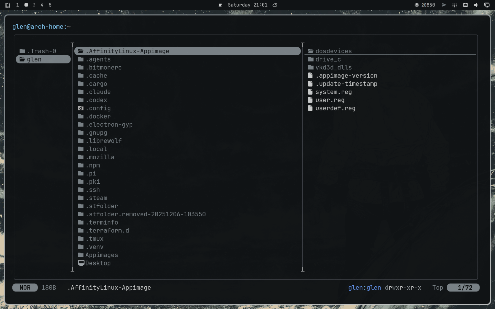

# omarchy-yazi

**Yazi flavors for every Omarchy theme.** Change your theme with
`omarchy theme set <theme>` (or the quickshell switcher) and every yazi
window you open matches it — no per-app theming, no stale colors.

Generates a yazi flavor from each Omarchy theme's `colors.toml` palette and
installs a `theme-set` hook so the matching flavor is activated automatically
on every theme change.

| Themed with Omarchy | | |
|:---:|:---:|:---:|
|  |  |  |

## Install

```bash
omarchy plugin add https://github.com/Glen-Sumner/omarchy-yazi.git --enable
```

That's it. The plugin registers a headless shell service which:

1. generates flavors for all your themes into `~/.config/yazi/flavors/omarchy-*.yazi/`
2. points `~/.config/yazi/theme.toml` at the flavor of your current theme
   (your existing `theme.toml` is preserved at `theme.toml.pre-omarchy`)
3. watches the active theme and updates yazi's config whenever you change it

### Manual alternative

Don't want the shell service? `./install.sh` installs just the generator and
does a one-shot sync; re-run it after theme changes.

> Note: Yazi does not live-reload theme changes, so already-open windows keep
> their colors until you relaunch them. Every newly opened window follows the
> active theme automatically.

## How it works

```
omarchy theme set gruvbox
  └─ omarchy-theme-set applies the palette system-wide
       └─ current/theme.name changes
            └─ Yazi Theme Sync service notices
                 ├─ regenerates ~/.config/yazi/flavors/omarchy-gruvbox.yazi/
                 └─ repoints [flavor] dark/light in ~/.config/yazi/theme.toml
```

Both `[flavor] dark` and `light` are pointed at the same generated flavor,
so terminal background detection never picks the wrong palette.

### Palette schema handling

Omarchy themes come in three shapes; the generator understands all of them:

| Schema | Example themes | Notes |
|---|---|---|
| Semantic (`accent`, `muted`, `lighter_background`, …) | catppuccin, tokyo-night, solitude, … | stock Omarchy themes |
| ANSI-only (`color0`–`color15`) | moon-orbit, hinterlands | user-installed git themes |
| Alacritty-only | glory-antic | converted via omarchy's own tool |

Light/dark mode is auto-detected from background luminance when the theme
doesn't declare it.

## Manual use

```bash
omarchy-yazi-flavor              # regenerate + activate current theme's flavor
omarchy-yazi-flavor nord         # same, for one theme
omarchy-yazi-flavor --all        # rebuild every flavor
```

## Security model

The current-theme state file (`~/.local/state/omarchy/current/theme.name`)
and `omarchy theme list` output live in user-writable space, so the plugin
treats them as untrusted input:

- **Bounded reads** — the state file is read only if it is a regular,
  non-symlink file, at most 256 bytes, under a 2 s hard deadline
  (`timeout` with SIGKILL escalation). A FIFO or device node swapped into
  that path fails closed instead of hanging the helper.
- **Hard process deadline** — the shell service escalates any helper run:
  SIGTERM after 30 s, SIGKILL 5 s later.
- **Watched path never loaded** — the FileView watcher runs with
  `preload: false`, and every sync first re-checks the watched path is a
  regular, non-symlink file before doing anything (exit 75 otherwise).
- **Names are path-safe** — theme names are slugified and then must match
  `^[a-z0-9][a-z0-9._-]*$` (≤64 chars) before being interpolated into any
  flavor/palette path; `/`, `..`, hidden names, and control characters are
  rejected. On any anomaly the plugin exits without writing, leaving the
  last good flavor active.
- **Bounded enumeration** — `--all` reads the theme list under a 5 s
  deadline, processes at most 64 themes per run, and skips untrusted names
  before they can become write targets.

## Uninstall

```bash
./uninstall.sh   # removes hook + generator, restores original theme.toml,
                 # deletes generated omarchy-* flavors
```

## Requirements

- [Omarchy](https://omarchy.org/) (Hyprland-based Arch)
- [yazi](https://yazi-rs.github.io/) file manager

## License

MIT — see [LICENSE](LICENSE).
